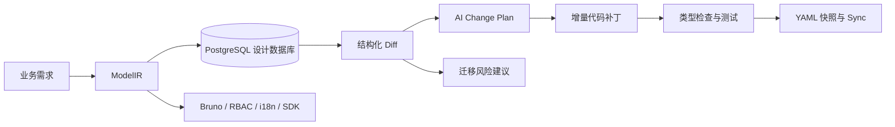

# Mozi Builder

[](https://github.com/pangu-studio/mozi-builder/releases)
[](https://github.com/pangu-studio/mozi-builder/actions/workflows/release-cli.yml)

Mozi Builder 是一个面向 AI Coding 的模型驱动开发平台。它用统一的 ModelIR 描述领域语义、数据结构、管理后台、产品 UI 和 API 意图，并将模型变更转换为可审查的差异、影响分析与增量代码计划。

Mozi 不把模板覆盖作为主流程。设计数据库保存模型事实，AI Agent 根据 Change Plan 修改真实代码，人负责审查风险、迁移和最终结果。

当前版本：`0.2.1`

## 核心能力

- PostgreSQL 设计数据库：保存模块、模型、版本历史、错误码和设计字典
- ModelIR：字段、关系、语义、权限、UI Intent、API Intent 和测试合约
- 结构化差异：识别新增、修改、删除和显式字段重命名
- 兼容性分类：`safe`、`conditional`、`breaking`、`unknown`
- AI Change Plan：输出影响文件、执行任务、验证命令和审批要求
- 安全迁移建议：仅自动生成全部为 `safe` 的 SQL migration
- 契约产物：Bruno、RBAC 骨架、i18n 目录、OpenAPI TypeScript SDK
- 可嵌入开发平台：Gin API 与 React/Ant Design Builder 组件库
- 跨平台 CLI：Linux、macOS、Windows 的 amd64/arm64 Release

## 工作方式



设计数据库是模型事实来源，`models/` 是用于 Git 审查和交换的 YAML 快照。OpenAPI 是 HTTP 请求、响应及 SDK 的事实来源。

## 安装 CLI

从 [GitHub Releases](https://github.com/pangu-studio/mozi-builder/releases) 下载对应平台的最新产物：

| 平台 | amd64 | arm64 |
|---|---|---|
| Linux | `mozi_linux_amd64.tar.gz` | `mozi_linux_arm64.tar.gz` |
| macOS | `mozi_darwin_amd64.tar.gz` | `mozi_darwin_arm64.tar.gz` |
| Windows | `mozi_windows_amd64.zip` | `mozi_windows_arm64.zip` |

每个 Release 都包含 `checksums.txt`。安装前应校验 SHA-256，安装后运行：

```bash
mozi --version
```

### 从源码构建

需要 Go `1.26.4` 或与 `go.mod` 兼容的更高版本。

```bash
git clone https://github.com/pangu-studio/mozi-builder.git
cd mozi-builder
make test
make build
./bin/mozi --version
```

安装到指定目录：

```bash
make install PREFIX="$HOME/.local"
```

确保 `$HOME/.local/bin` 已加入 `PATH`。

## 快速开始

### 1. 准备设计数据库

Mozi 使用独立的 PostgreSQL 设计数据库，不依赖 SQLite 或 CGO。

```bash
createdb memflow_design
export MOZI_DB='postgres://localhost:5432/memflow_design?sslmode=disable'
```

### 2. 初始化项目

在已有 Go 业务项目中：

```bash
export MOZI_PROJECT_ROOT="$PWD"
mozi init
```

或者创建一个包含 Go 后端和 React Web 的新项目：

```bash
mozi new myapp --module github.com/example/myapp

# 可选：同时生成 Tauri 桌面端和微信小程序骨架
mozi new myapp --module github.com/example/myapp --desktop --miniapp
```

### 3. 创建模型

模型创建和更新以完整 ModelIR 为输入。下面是一个最小示例：

```bash
mozi model create --json '{
  "module": "content",
  "model": "Deck",
  "label": "牌组",
  "description": "用于组织卡片",
  "table": "decks",
  "fields": [
    {"name":"id","type":"string","label":"ID","primary":true,"generated":"uuid"},
    {"name":"name","type":"string","label":"名称","required":true},
    {"name":"created_at","type":"time","label":"创建时间","auto_now_add":true},
    {"name":"updated_at","type":"time","label":"更新时间","auto_now":true}
  ],
  "relations": [],
  "semantics": {
    "purpose": "帮助用户按主题组织学习卡片",
    "audience": ["学习者"]
  },
  "api_intent": {
    "exposure": "client",
    "auth": "user_jwt",
    "operations": ["list", "get", "create", "update", "delete"]
  },
  "admin": {
    "list_columns": ["name", "created_at"],
    "search_fields": ["name"],
    "default_sort": "created_at",
    "default_order": "desc",
    "page_size": 20
  }
}'
```

### 4. 校验与获取变更计划

```bash
mozi validate
mozi lint --strict
mozi diff --model content/Deck
mozi change-plan --model content/Deck
```

根据 Change Plan 生成最小代码补丁，并在应用前审查 `breaking`、`conditional` 和 `dangerous` 项。

### 5. 验证并同步

```bash
go test ./...
mozi export --module content
git diff models/
mozi sync --model content/Deck
```

只有在代码、迁移、契约和测试都完成后才执行 `sync`。

## 常用命令

```bash
# 模型 CRUD
mozi model get --model content/Deck --json
mozi model update --model content/Deck --json '<完整 ModelIR>'
mozi history --model content/Deck
mozi rollback --model content/Deck --version <version>

# YAML 快照
mozi import --dir models/
mozi export --dir models/

# 错误码
mozi error-code list --json
mozi error-code upsert DECK_NOT_FOUND \
  --domain content --status 404 --category resource \
  --message '牌组不存在' --consumer-facing

# 设计字典
mozi dictionary list api_consumers --json

# 契约产物
mozi artifacts migration --model content/Deck --out migrations
mozi artifacts bruno --model content/Deck --openapi docs/swagger.json --out contracts/bruno
mozi artifacts permissions --model content/Deck --out internal/permissions/generated.go
mozi artifacts i18n --locale zh-CN --out locales/source.json
mozi artifacts i18n-validate --locale en --input locales/en.json
mozi artifacts typescript-sdk --openapi docs/swagger.json --out sdk/typescript/client.ts
```

运行 `mozi <command> --help` 查看完整参数。

## 数据库迁移安全

`mozi artifacts migration` 只会为全部为 `safe` 的步骤生成 `.up.sql` 和 `.down.sql`。

以下情况必须人工审查，命令会拒绝自动生成：

- 删除字段或可能导致数据丢失的操作
- 字段类型收窄或需要显式 `USING` 的转换
- 字段或表重命名
- 新增无默认值的必填字段
- 无法证明可安全回滚的变化

Change Plan 中展示的 SQL 是建议，不是执行授权。

## 错误码与权限

错误码在项目级注册表中统一维护。API Intent 和测试合约只能引用已经注册的 code。Builder UI 提供错误码管理页，删除仍被模型引用的错误码时后端会拒绝操作。

权限优先使用结构化 `semantics.permission_rules`：

```yaml
permission_rules:
  - effect: allow
    principal: user
    resource: deck
    action: update
    scope: own
    owner_field: user_id
```

生成的 RBAC 代码只包含常量和 `Authorizer` 骨架。授权必须在服务端执行，前端判断只能控制界面显示。

## 嵌入 Gin API

Mozi Builder 不启动独立服务器。宿主应用负责 HTTP 生命周期、认证、CORS、日志和部署。

```go
designDB, err := db.InitDB(os.Getenv("MOZI_DB"))
if err != nil {
    log.Fatal(err)
}

store := db.NewStore(designDB)
engine := devplatform.NewDevPlatformEngine()
service := devplatform.NewService(store, engine)
handler := devplatform.NewHandler(service)

api := router.Group("/api/dev-platform")
api.Use(builderAuthMiddleware())
devplatform.RegisterRoutes(api, handler)
```

设计数据库不可用时，可用 `RegisterUnavailableRoutes` 为相同路由面返回统一的 `503`。

## 嵌入 React Builder

`builder-react` 是组件库，不是独立应用。它导出：

- `MoziBuilderProvider`
- `BuilderRoutes`
- `createMoziBuilderMenuItem`

宿主项目负责提供 Axios client、认证拦截器、路由容器和整体布局。

```tsx
import {
  BuilderRoutes,
  MoziBuilderProvider,
} from '@pangu-studio/mozi-builder-react'

<MoziBuilderProvider
  apiClient={apiClient}
  apiBasePath="/api/dev-platform"
  routeBasePath="/dev-platform"
>
  <Routes>
    <Route path="dev-platform">
      {BuilderRoutes()}
    </Route>
  </Routes>
</MoziBuilderProvider>
```

Builder 包含模型卡片、模型设计器、ER 图、Diff/Change Plan、API Workbench、错误码管理和操作指南。

## 项目结构

```text
mozi-builder/
├── cmd/mozi/             # Cobra CLI 与项目脚手架
├── mozi/                 # IR、parser、lint、diff、DB 和产物生成核心
│   ├── apicontract/      # Bruno 合约
│   ├── apierror/         # 统一错误响应类型
│   ├── db/               # PostgreSQL 设计数据库
│   ├── differ/           # 结构化差异与兼容性分类
│   ├── i18n/             # 翻译目录提取与校验
│   ├── migration/        # 迁移建议与安全渲染
│   ├── parser/           # YAML 解析、Validate 与 Lint
│   ├── rbac/             # 权限判断与 Go 骨架
│   └── sdk/              # OpenAPI TypeScript SDK
├── devplatform/          # 可嵌入 Gin API
├── builder-react/        # React/Ant Design Builder 组件库
├── skills/mozi/          # Agent Skill
├── docs/                 # 路线图与设计文档
└── .github/workflows/    # 跨平台 CLI Release
```

## 本地开发

```bash
# Go
go test ./...
make build

# React Builder
cd builder-react
npm install
npm run build
```

沙箱无法访问默认 Go 缓存时：

```bash
GOCACHE=/tmp/mozi-go-cache go test ./...
```

提交前建议执行：

```bash
go test ./...
./builder-react/node_modules/.bin/tsc -p builder-react/tsconfig.json --noEmit
npm --prefix builder-react run build
git diff --check
```

## 发布

推送 `v*` tag 会触发 [Release Mozi CLI](.github/workflows/release-cli.yml)：

1. 运行完整 Go 测试
2. 以 `CGO_ENABLED=0` 构建六个平台产物
3. 生成 SHA-256 `checksums.txt`
4. 创建 GitHub Release 并上传压缩包

发布前必须同步以下版本：

- `VERSION`
- `builder-react/package.json`
- `builder-react/package-lock.json`
- `skills/mozi/SKILL.md` frontmatter

示例：

```bash
git tag v0.2.1
git push origin v0.2.1
```

## 设计原则

- 可信优先于覆盖面
- 设计数据库是模型事实来源
- OpenAPI 是 HTTP 契约事实来源
- Agent 生成建议，人审查高风险变化
- 安全变化可自动化，危险变化必须显式审批
- 生成代码必须与手写代码和平共存

后续演进计划见 [docs/evolution-roadmap.md](docs/evolution-roadmap.md)。
